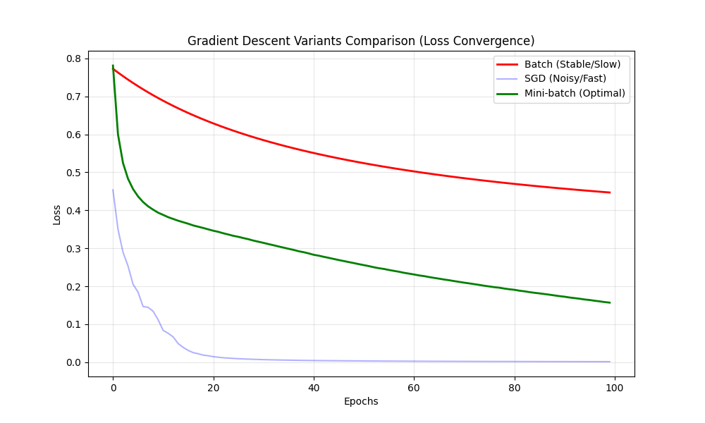

# 🔬 Gradient Descent Variants: Comparative Analysis

## 📋 Project Objective
The main goal of this mini-project was to conduct a technical experiment to observe and compare the behavior of different **Gradient Descent** optimization variants. By running a controlled simulation, I analyzed how the choice of optimization method affects the convergence speed and stability of a Neural Network.

## 🧪 The Experiment
Using a NumPy-based Neural Network implementation, I tested three fundamental optimization strategies on a synthetic classification dataset (1,000 samples, 20 features):

1. **Batch Gradient Descent**: Updates weights once per epoch using the entire dataset.
2. **Stochastic Gradient Descent (SGD)**: Updates weights after every single training sample.
3. **Mini-batch Gradient Descent**: Updates weights using small subsets (batch_size=32).

## 📊 Performance & Convergence Analysis
The primary focus of this project is the visualization of the Log Loss reduction over 100 epochs:

### 🧠 Observed Behaviors:
* **SGD (Blue)**: Demonstrated the fastest initial drop in loss. This confirms its ability to perform rapid updates, although it introduces high stochastic noise.
* **Mini-batch (Green)**: Showed the most balanced performance. It achieves quick convergence while remaining much more stable than pure SGD.
* **Batch (Red)**: Proved to be the least efficient for this scale, showing a very slow, albeit smooth, decrease in loss.

## 💡 What I learned from this test:
* How the frequency of weight updates directly impacts the training "smoothness" and speed.
* Why **Mini-batch** is the industry standard for large-scale tasks (balancing hardware efficiency with learning stability).
* How to interpret **Loss Curves** to diagnose model training health.

## 🛠️ Tech Stack
* **Python** & **NumPy** (Core Logic)
* **Matplotlib** (Results Visualization)
* **Scikit-learn** (Dataset Generation & Scaling)
